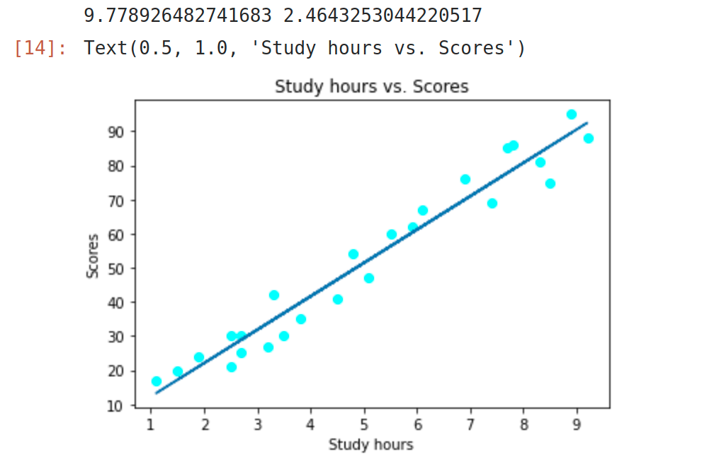
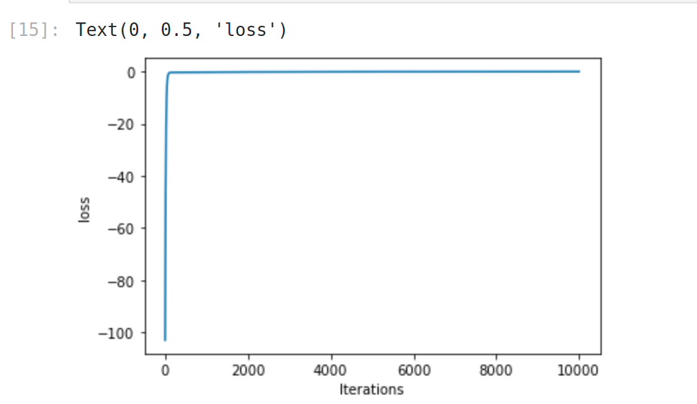

# Implementation-of-Linear-Regression-Using-Gradient-Descent

## AIM:
To write a program to implement the linear regression using gradient descent.

## Equipments Required:
1. Hardware – PCs
2. Anaconda – Python 3.7 Installation / Moodle-Code Runner

## ALGORITHM:
## Step 1:
Use the standard libraries such as numpy, pandas, matplotlib.pyplot in python for the Gradient Descent.

## Step 2:
Upload the dataset conditions and check for any null value in the values provided using the .isnull() function.

## Step 3:
Declare the default values such as n, m, c, L for the implementation of linear regression using gradient descent.

## Step 4:
Calculate the loss using Mean Square Error formula and declare the variables y_pred, dm, dc to find the value of m.

## Step 5:
Predict the value of y and also print the values of m and c.

## Step 6:
Plot the accquired graph with respect to hours and scores using the scatter plot function.

## Step 7:
End the program.

## PROGRAM:
```
Program to implement the linear regression using gradient descent...

Developed by: Silambarasan.K
RegisterNumber: 212221230101

import numpy as np
import pandas as pd
import matplotlib.pyplot as plt
data = pd.read_csv("student_scores.csv")
data.head()
data.isnull().sum()
x = data.Hours
x.head()
y = data.Scores
y.head()
n = len(x)
m = 0
c = 0
L = 0.001
loss = []
for i in range(10000):
    ypred = m*x+c
    MSE = (1/n)*sum((ypred-y)*2)
    dm = (2/n)*sum(x(ypred-y))
    dc = (2/n)*sum(ypred-y)
    c = c-L*dc
    m = m-L*dm
    loss.append(MSE)
    #print(m)
print(m,c)
y_pred = m*x+c
plt.scatter(x,y,color = "cyan")
plt.plot(x,y_pred)
plt.xlabel("Study hours")
plt.ylabel("Scores")
plt.title("Study hours .vs. Scores")
plt.plot(loss)
plt.xlabel("Iterations")
plt.ylabel("loss")
```

## Output:



## Result:
Thus the program to implement the linear regression using gradient descent is written and verified using python programming.
